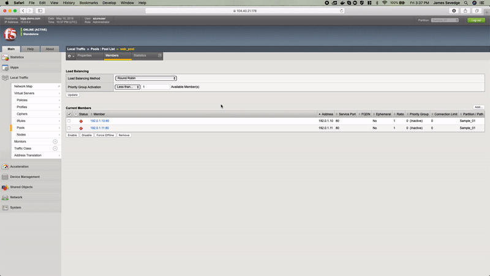

# Introduction

Serverless demo using Azure Functions. Function provides microservice to allow for interaction with BIG-IP(s) around discovery and configuration.

## Demo



## Usage

POST `https://myfunctionapp.azurewebsites.net/api/config_mgmt?code=foo`

```json
{
	"host": "x.x.x.x",
	"user": "admin",
	"password": "admin",
	"configDeclaration": {
	    "class": "AS3",
	    "action": "deploy",
	    "persist": true,
	    "declaration": {
	        "class": "ADC",
	        "schemaVersion": "3.0.0",
	        "label": "HTTP application",
	        "remark": "Simple HTTP application with RR pool",
	        "Sample_01": {
	            "class": "Tenant",
	            "A1": {
	                "class": "Application",
	                "template": "http",
	                "serviceMain": {
	                "class": "Service_HTTP",
	                "virtualAddresses": [
	                    "10.0.1.10"
	                ],
	                "pool": "web_pool"
	                },
	                "web_pool": {
	                "class": "Pool",
	                "monitors": [
	                    "http"
	                ],
	                "members": [{
	                    "servicePort": 80,
	                    "serverAddresses": [
	                        "192.0.1.10",
	                        "192.0.1.11"
	                    ]
	                }]
	                }
	            }
	        }
	    }
	}
}
```

Response:

```json
{
    "info": {
        "version": "14.1.0.3"
    },
    "configResponse": {
        "message": "success"
    }
}
```

## Notes

Helpful tutorial explains steps to get started: https://docs.microsoft.com/en-us/azure/azure-functions/functions-create-first-function-python

- Publish: ```func azure functionapp publish <function app name> --build-native-deps```
- Changes: Make changes to `__init__.py` and re-publish.